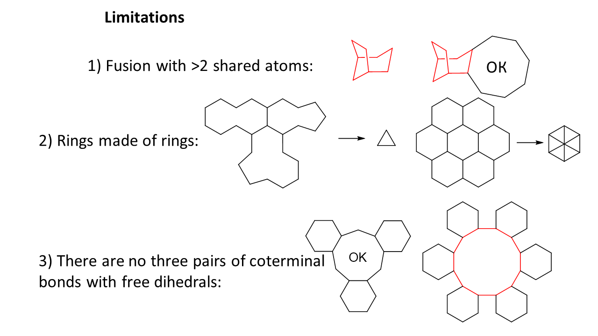

# Inverse kinematics-based conformational search algorithm RCRI (Resolve, Connect, Refine, Iterate)

### Table of Contents

* [1. Setup and usage](#1-setup-and-usage)
  * [1.1. Executables of conformational search script](#11-executables-of-conformational-search-script)
  * [1.2. Prerequisites](#12-prerequisites)
  * [1.3. Setup](#13-setup)
  * [1.4. Usage](#14-usage)
* [References](#references)
* [TODO](#todo)

## 1. Setup and usage

### 1.1. Executables of conformational search script

Use of executables for Windows or Linux is the easiest way to run SC algorithm because this does not require installation of any prerequisites. If you wish to try out the executable version, use the Google Drive link below to download archived program, test suite and examples of config file and input geometry.

**For Windows:** [Google Drive link to executable](https://drive.google.com/file/d/1AU1G17APSrah6Cur8ZO9MDO2w6Q5frNL/view?usp=sharing)

**For Linux:** [Google Drive link to executable](https://drive.google.com/file/d/1mGHUjjuqzRh3uy6JAUiiEL99m6oHAPoj/view?usp=sharing)

Instructions in sections 1.2-1.3 are intended for users who wish to run `rcrilib` as python-library and be able to modify any part of the conformational search algorithm.

However, explanations in section 1.4 are intended for all the users because these sections contain basic information about the algorithm, features of this implemetation and its limitations.

### 1.2. Prerequisites

gcc; g++; gfortran; cmake; Python 3 with libararies numpy, scipy, networkx and rdkit (the last one is optional).

NumPy is essential for handling matricies and vectors. SciPy is required for kd-tree-based algorithm of detection of undesired overlaps of atoms. Networkx is needed for working with graphs. RDKit is used outside of the library in`testing/smiles_to_mol.py` script for convenient generation of molecule's 3D geometry from its SMILES.

At this time the `rcrilib` Python-library was tested out of the box on Linux machines only.

The core functionality of the library was implemented using Python. However, to generate cycle geometries it is necessary to execute the TLC algorithm, which is implemented in Fortran and C (see files `tlc_src/*.f90` and `tlc_src/sturm.c`). In order to pass input data to TLC from the main code and return the output, the C++ interface was realized for convenient data transfer between Python- and Fortran-programs (see `tlc_src/main.cpp`). All the files in `tlc_src` directory have to be compiled and linked into `libtlc.so` library. Produced file has to be moved in `rcrilib/Solvers` directory. All of these tasks were automated using CMake (see `CMakeLists.txt`). We will explain how to use it in the following section.

### 1.3. Setup

1. Clone the repository:

```
git clone https://github.com/nkrivoshchapov/RCRI.git
cd RCRI
```

2. If you wish to use the library only from this directory, then execute the following 

```
mkdir build && cd build
cmake ..
make
make install
cd ..
```

In this way, the library `libtlc.so` will be built and copied into `rcrilib/Solvers`. Which means that `rcrilib` will become a functioning python-library loadable only from `RCRI` directory.

If you wish to install this library as your Python-package for it to be accessable from any directory, then execute this instaed:

```
pip install .
```

This will build `libtlc.so`, copy it into `rcrilib/Solvers` and install the `rcrilib` as Python-package.

3. Check the correctness of the installation on test molecules:

```
cp testing/run_tests.py testing/default.ini .
python run_tests.py
```

This script generates a few conformations for each structure in `testing` directory.

4. (Optional) Install Anaconda and RDKit.

Python-library [RDKit](https://www.rdkit.org/docs/index.html) can be used to generate 3D geometry of a molecule from its SMILES, that can be [taken from ChemDraw](https://people.stfx.ca/blynch/CS%20ChemOffice%202004/CS%20ChemDraw/CS%20ChemDraw%20Help/CD8ch11a4.html). So, input data can be quickly generated from molecule's drawing. 

First, [install conda](https://docs.anaconda.com/anaconda/install/linux/) by running instructions like (**the commands below might be outdated**):

```
wget https://repo.anaconda.com/archive/Anaconda3-2020.07-Linux-x86_64.sh
bash ./Anaconda3-2020.07-Linux-x86_64.sh
conda update --prefix /home/$USER/anaconda3 anaconda
```

And then install RDKit:

```
conda install -c conda-forge rdkit
```

### 1.4. Usage

The `rcrilib` provides all necessary procedures to manupulate molecular geometry using inverse kinematics, but the algorithm of conformational search itself is stored in the driver-script outside of the library (see examples in `confsearch_drivers` directory). Workflow is that user executes a driver-script that generates conformations by calling functions from `rcrilib`.

**1. Create an input MOL-file of the desired molecule, you want to run conformational search for.**

In order to run conformational search, this method requires the connectivity of molecule (its graph), bond lengths and valence angles. However, data in XYZ is not enough, because it does not contain connectivity information. Therefore, MOL is chosen to be format for input geometry since these files (extension `.sdf` or `.mol`, see examples in directory `testing`) contain all necessary information.

MOL-file of starting geometry can be drawn in any editor, like GaussView, ChemCraft, etc. Or, if you have carried out the instructions of step 4 in section 1.3, input data can be generated from [molecule drawing](https://people.stfx.ca/blynch/CS%20ChemOffice%202004/CS%20ChemDraw/CS%20ChemDraw%20Help/CD8ch11a4.html). In order to do it, select the structure of interest in ChemDraw, press Ctrl+Alt+C to copy it as SMILES. Then run

```
cp testing/smiles_to_mol.py .
```

and change the 4th lines in the script by selecting the text in quotes and then pressing Ctrl+V. After that, input MOL-file can be generated by executing the script `smiles_to_mol.py`: `

```
python smiles_to_mol.py
```

In order to keep some of the dihedral angles fixed during conformational search, open `molfromsmiles.sdf` and set the type of corresponding bond to anything except single.

**2. Set options of `rcrilib` and conformational search driver in config-file.**

The directory `testing` already contains the config-file `default.ini` as an example. Copy it in the directory from where you wish to run the conformational search script. The contents of config-file are given below:

```
[IK_All]
RunGeomCheck = True
MinDistance = 1.2
DoValidation = False
SmartAPS = True

[IK_Molecule]
DoValidation = True

[IK_FlappingSolver]
GenerationMode = intime
AngleThreshold = 10

[IK_TLCSolver]
AllowBondPerturbation = False
AllowAnglePerturbation = False
BondSDeviation = 0.1
AngleSDeviation = 10

[MCDriver]
InputFile = molfromsmiles.sdf
OutputFile = res_%%d.mol
MaxTries = 400
MaxIter = 100
NumberOfConfs = 10
PrintLevelConsole = warning
PrintLevelFile = warning
LogFile = montecarlo.log
AutoCleanup = True

[Testing]
NumberOfConfs = 5
TestMolecules = testing/*.sdf
```

Section `IK_All` contains the parameters of `rcrilib`

* `RunGeomCheck` - whether to eliminate conformations with atomic overlaps.

* `MinDistance` - the minimum distance between unbound atoms when `RunGeomCheck` is enabled.

* `DoValidation` - whether to check if found conformations satisfy the geometric constrains (bond lengths, valence and dihedral angles). This feature is mainly for debugging and it is not compatible with neither `AllowBondPerturbation` or ``.

* `SmartAPS` - performance-improving feature. Functions do not generate the conformations of the parts of the molecule again if their degrees of freedom have not changed since the last run.

Flags in the `IK_All` section are accessible to all classes in the library. If it is desired to override the `IK_All` parameter value for some particular class, an another section named as that class has to be created (see the `IK_Molecule` section in the example above). In the example above the value of `DoValidation` parameter was overwritten within `IK_Molecule` class. As a result, geometry validation step is executed only for the final conformation, but not for intermediate structures on levels of `IK_CyclicPart`, `IK_GeomUnit` etc.

Some of options are targeted specifically for only one class. It is valid to set their values inside `IK_All` section, however, these keys are set from section of their target class so that its easier to remember their purpose. Thus, `IK_FlappingSolver` generates conformers by "flapping" atoms and bonds, this class has two associated parameters:

* `GenerationMode` - `cached` or `intime` - at which point "flapping" operations should be executed. Value `intime` sets library to generate conformers by "flapping" just in time when they are requered during iterations over degrees of freedom. `intime` mode is more memory-efficient and more time-efficient in the short run and when the number of possible flapping operations is very large. Mode `cached` sets library to pregenerate and store conformations by iterating over all acceptable flapping combinations during initialization before these geometries are requested. `cached` mode is faster in the long run but initialization may a lot of resources for large cycles with a lot of possibilities for "flapping".

* `AngleThreshold` - parameter that determines the tolerance to valence angle distortion. Geometrically, flapping of a fragment of a cycle preserves valence angles if and only if bonds at the ends of the fragment are coplanar, meaning that dihedral angle on these four terminal atoms is zero. If this diheral angle deviates from zero, then valence angles will be distorted by flapping and the bigger the deviation - the larger the distortion. `AngleThreshold` is the maximal absolute value of dihedral angle for which flapping is acceptable.

Class `IK_TLCSolver` is responsible for generation of cycle geometries with TLC and it has 4 specific parameters associated with random perturbations in the lengths and bond angles during the generation of geometries in order to increase the variety of conformers:

* `AllowBondPerturbation` - whether to use random perturbations of bond lengths in cycles solved by TLC algorithm. This feature is not compatible with `DoValidation`.

* `AllowAnglePerturbation` - whether to use random perturbations of valence angles in cycles solved by TLC algorithm. 

* `BondSDeviation` - standard deviation of normally distributed perturbation in angstroms added to bond lengths.

* `AngleSDeviation` - standard deviation of normally distributed perturbation in angles added to valence angles.

`MCDriver` section contains settings of conformational search driver scripts (`simple_mc.py`, `recursive_mc.py`, `ddof_mc.py` and `run_tests.py`):

* `InputFile`- mol-file containing information about connectivity of the molecule, optimal bond lengths and valence angles. `rcrilib` treats bonds of type "single" differently from all others - dihedral angles of single bonds are allowed to rotate and considered as degrees of freedom, while all others are fixed. This parameter is required by driver-scripts `simple_mc.py`, `recursive_mc.py` and `ddof_mc.py`.

* `OutputFile` - files with resulting geometries to be created (%%d will be substituted with count number). Extensions `.mol` and `.xyz` will be detected automatically. This parameter is required by driver-scripts `simple_mc.py`, `recursive_mc.py` and `ddof_mc.py`.

* `NumberOfConfs` - number of conformers to be found. This parameter is required by driver-scripts `simple_mc.py`, `recursive_mc.py` and `ddof_mc.py`.

* `MaxIter` - maximal number of attempts to generate a conformation. Program will make as many attempts as needed to reach `NumberOfConfs` geometries if `MaxIter` is set to -1.

* `MaxTries` - maximal allowed number of attempts to redefine the unsuccessfully chosen values of the degrees of freedom (eliminate VdW clash or make TLC to return non-zero number of solutions). The optimal value of `MaxTries` is larger for bigger molecules and *vice versa*.

* `PrintLevelConsole` - parameter that controls the amount of output in console. Options: `none`, `error`, `warning`, `info`, `debug`.

* `PrintLevelFile` - parameter that controls the amount of output in log-file. Options: `none`, `error`, `warning`, `info`, `debug`. In case if exception occurs, driver-script will automatically create a bugreport directory containing log-file and values of degrees of freedom.

* `LogFile` - name of the log-file.

* `AutoCleanup` - whether to remove log-file after successful termination of driver-script.

Section `Testing` contains parameters of automated testing of the library on about 25 molecules (driver-script `run_tests.py`).

* `TestMolecules` - input-files for testing.

* `NumberOfConfs` - number of conformations to be generated for each test molecule.

For a routine conformational search run user should set the values of `InputFile`, `OutputFile`, `NumberOfConfs` options in section `MCDriver` and, optionally, `MinDistance` in section `IK_All`.

**3. Execute the driver-script.**

Directory `confsearch_drivers` contains 3 examples of driver-scripts (difference between them is explained in section 2.2). For instance, to apply `recursive_MC.py` one should run the following commands:

```
cp confsearch_drivers/recursive_MC.py .
python recursive_MC.py
```

Settings will be loaded from config-file of default name `./default.ini` or any other file, if its name was passed as an argument (for example, `python recursive_MC.py myconfig.cfg`).

Limitations of this algorithm are shown on the figure below:



# References

**Papers on the TLC algorithm:**

Coutsias E.A., Seok C., Jacobson M.P., Dill K.A. A kinematic view of loop closure // Journal of Computational Chemistry. – 2004. – Vol. 25, № 4. – P. 510–528. – DOI: https://doi.org/10.1002/jcc.10416 

Coutsias E.A., Seok C., Wester M.J., Dill K.A. Resultants and loop closure // International Journal of Quantum Chemistry. – 2006. – Vol. 106, № 1. – P. 176–189. – DOI: https://doi.org/10.1002/qua.20751

**Link to open-source implementation of TLC:**

https://math.unm.edu/~vageli/codes/loop-closure.tar.gz

**Earlier mentions of corner flapping and edge flipping procedures:**

Goto H., Osawa E. Corner flapping: a simple and fast algorithm for exhaustive generation of ring conformations // J. Am. Chem. Soc. – American Chemical Society, 1989. – Vol. 111, № 24. – P. 8950–8951. – DOI: https://doi.org/10.1021/ja00206a046

Gotō H., Ōsawa E. An efficient algorithm for searching low-energy conformers of cyclic and acyclic molecules // J. Chem. Soc., Perkin Trans. 2. – The Royal Society of Chemistry, 1993. – № 2. – P. 187–198. – DOI: https://doi.org/10.1039/P29930000187

